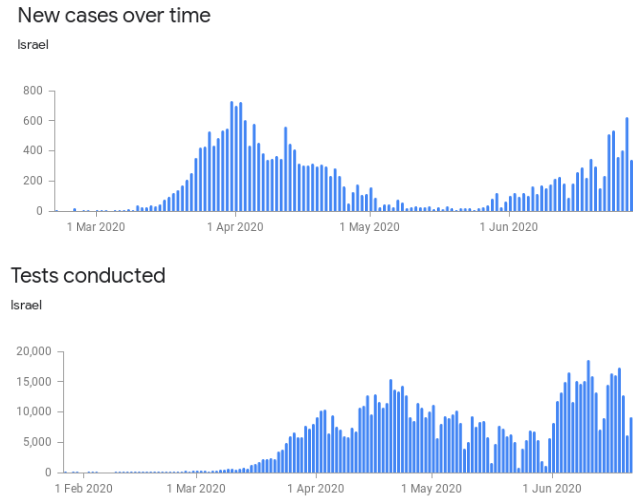

# CoViD-19 wave normalizer

## What it does

This script pulls CoViD-19 data from the web and processes it, producing a csv table with the daily new cases, normalized to the daily tests conducted. In simple terms that is: percent positive tests, per day.

## Why *NOT* to use it (disclaimer)

Firstly this is just a fun scripting exercise I did, although I have a degree in Biologoy, this is not my daily work or expertise. Go consult the WHO, a doctor, or some real professional! ;-)

However, this information is not very useful unless one knows the distribution of the tests (where & from who they were taken). Results can easily be skewed if the tests are not distributed equally between healthy and infected populations. Skewed data can easily be used to drive certain political/social/economic interests or set certain narratives. As with in many topics, the bigger picture is often more complicated.

## Why to use it

This information allows us to slightly better asses the presence and magnitude of ~~a second~~ CoViD-19 waves.

Here, is an example demonstrating the problem. These are some charts from :

At a glance, one can see a "second wave" in the *New cases over time* chart. However one can *also* see another "wave" in the *Tests conducted* chart. Might the increase in cases simply be due to the increase in tests?

To answer this, we can normalize the amount of new cases by the amount of tests conducted, which returns the *Percent positive tests*. This is what the script does.

If we plot this normalized data, here is the chart we get:

## How to use it

From your command line: `./main.py ISO_CODE [debug] [usecache] [help]`, output data will be save to `data_output.csv` in the current working directory.

Where:
- `ISO_CODE` (required) filter data only of this country.
- `print`    script outputs results while running.
- `debug`    script prints more output while running.
- `usecache` use the local file (if present) instead of downloading data again.
- `help`     displays usage instructions.

Examples:
- `./main.py ISR print`
- `./main.py isr usecache debug`

**Note:** Not all countries' data have the columns required to perform this calculation. ISO codes ISR and USA, for example, do!

## What to do with output

- Plotting the output data on a chart in a spreadsheet will make the result more visible.
- Arguing on the internet with conspiracy theorists and anti-vaxxers (etc.) *might* be entertaining...

